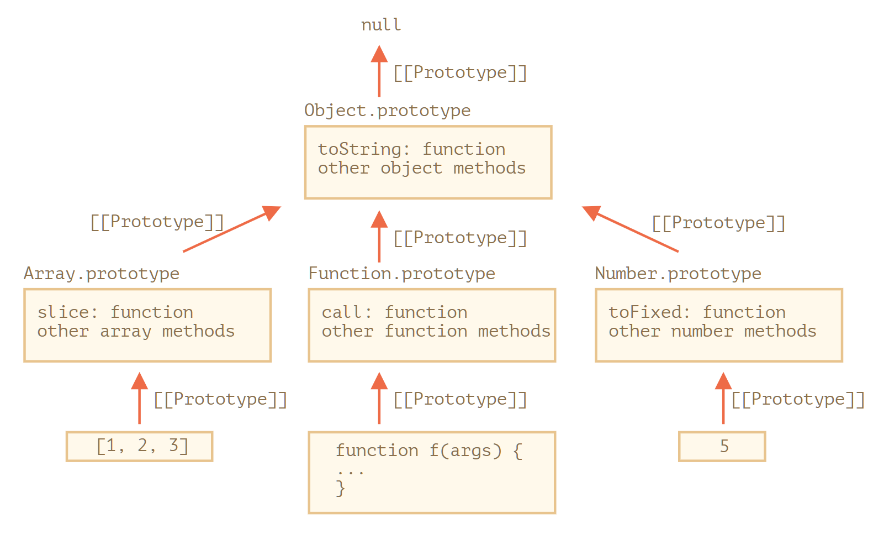

# Prototypes, inheritance <!-- omit in toc -->

[Home](../README.md)

<!-- omit in toc -->
## Topics
- [Prototypal inheritance](#prototypal-inheritance)
  - [Intro](#intro)
  - [The value of “this”](#the-value-of-this)
  - [for...in loop](#forin-loop)
  - [Examples](#examples)
- [F.prototype](#fprototype)
  - [Default F.prototype, constructor property](#default-fprototype-constructor-property)
  - [Examples](#examples-1)
- [Native prototypes](#native-prototypes)
- [Prototype Methods](#prototype-methods)
- [For better understanding](#for-better-understanding)


## Prototypal inheritance
[Home](../README.md) | [Jump to Top](#topics)

### Intro
[Home](../README.md) | [Jump to Top](#topics)

```js
let animal = {
  eats: true,
  walk() {
    alert("Animal walk");
  }
};
let rabbit = {
  jumps: true
};

rabbit.__proto__ = animal; // sets rabbit.[[Prototype]] = animal

// we can find both properties in rabbit now:
alert( rabbit.eats ); // true // reads from animal
alert( rabbit.jumps ); // true
// walk is taken from the prototype
rabbit.walk(); // Animal walk


let longEar = {
  earLength: 10,
  __proto__: rabbit
};

// walk is taken from the prototype chain
longEar.walk(); // Animal walk
alert(longEar.jumps); // true (from rabbit)
```

- multi-level allowed
- circular not allowed
- multiple not allowed

- **writing creates a new property in the object instead of overwriting the prototype object**
  ```js
  let animal = {
    eats: true,
    walk() {
      /* this method won't be used by rabbit */
    }
  };
  
  let rabbit = {
    __proto__: animal
  };
  
  rabbit.walk = function() {
    alert("Rabbit! Bounce-bounce!");
  };
  
  rabbit.walk(); // Rabbit! Bounce-bounce!
  ```

### The value of “this”
[Home](../README.md) | [Jump to Top](#topics)

- No matter where the method is found: in an object or its prototype. In a method call, this is always the object before the dot.
- when the inheriting objects run the inherited methods, they will modify only their own states, not the state of the big object.
```js
// animal has methods
let animal = {
  walk() {
    if (!this.isSleeping) {
      alert(`I walk`);
    }
  },
  sleep() {
    this.isSleeping = true;
  }
};

let rabbit = {
  name: "White Rabbit",
  __proto__: animal
};

// modifies rabbit.isSleeping
rabbit.sleep();

alert(rabbit.isSleeping); // true
alert(animal.isSleeping); // undefined (no such property in the prototype)
```

### for...in loop

```js
let animal = {
  eats: true
};

let rabbit = {
  jumps: true,
  __proto__: animal
};

// Object.keys only returns own 
alert(Object.keys(rabbit)); // jumps
alert(Object.values(rabbit)); // true

for(let prop in rabbit) {
  // lists even proto properties
  let isOwn = rabbit.hasOwnProperty(prop);

  if (isOwn) {
    alert(`Our: ${prop}`); // Our: jumps
  } else {
    alert(`Inherited: ${prop}`); // Inherited: eats
  }
}
```

- **NOTE**: Almost all other key/value-getting methods, such as Object.keys, Object.values and so on ignore inherited properties.  
They only operate on the object itself. Properties from the prototype are not taken into account.

### Examples
[Home](../README.md) | [Jump to Top](#topics)

Important: https://javascript.info/prototype-inheritance#why-are-both-hamsters-full

## F.prototype
[Home](../README.md) | [Jump to Top](#topics)

- setting proto **while creating object from constructor function** by setting `prototype` property

```js
let animal = {
  eats: true
};

let rodent = {
  type: "rodent"
}

function Rabbit(name) {
  this.name = name;
}

Rabbit.prototype = animal;

let rabbit = new Rabbit("White Rabbit"); //  rabbit.__proto__ == animal

alert(rabbit.eats); // true

Rabbit.prototype = rodent;

let rabbit2 = new Rabbit("White Rabbit"); //  rabbit.__proto__ == rodent

alert(rabbit2.type); // "roddent"
alert(rabbit2.eats); // "undefined" as proto is changed

```

```js
let user = {
  name: "John",
  prototype: "Bla-bla" // no magic at all
};
```

### Default F.prototype, constructor property
[Home](../README.md) | [Jump to Top](#topics)

```js
function Rabbit() {}
// by default:
// Rabbit.prototype = { constructor: Rabbit }

alert( Rabbit.prototype.constructor == Rabbit ); // true

let rabbit = new Rabbit(); // inherits from {constructor: Rabbit}

alert(rabbit.constructor == Rabbit); // true (from prototype)

```
```js
function Rabbit() {}
Rabbit.prototype = {
  jumps: true
};

let rabbit = new Rabbit();
alert(rabbit.constructor === Rabbit); // false
```
- add property to the default prototype instead:
  ```js
  function Rabbit() {}
  
  // Not overwrite Rabbit.prototype totally
  // just add to it
  Rabbit.prototype.jumps = true
  // the default Rabbit.prototype.constructor is preserved
  ```

  ### Examples

  Important:
  - https://javascript.info/function-prototype#changing-prototype
  - not so much important: https://javascript.info/function-prototype#changing-prototype

## Native prototypes
[Home](../README.md) | [Jump to Top](#topics)



- ```js
  let arr = [1, 2, 3];
  
  // it inherits from Array.prototype?
  alert( arr.__proto__ === Array.prototype ); // true
  
  // then from Object.prototype?
  alert( arr.__proto__.__proto__ === Object.prototype ); // true
  
  // and null on the top.
  alert( arr.__proto__.__proto__.__proto__ ); // null
  ```
- Native prototypes can be modified, but should not be as it may cause conflicts and overwriting of actual functions
  - Only allowed for `polyfills`, when the functionality doesnt exist
- ```js
  String.prototype.show = function() {
    alert(this);
  };
  
  "BOOM!".show(); // BOOM!
  ``` 
- All built-in objects follow the same pattern:
  - The methods are stored in the prototype (Array.prototype, Object.prototype, Date.prototype, etc.)
  - The object itself stores only the data (array items, object properties, the date)
- ```js
  Function.prototype.defer = function(ms) {
    setTimeout(this, ms);
  };
  
  function f() {
    alert("Hello!");
  }
  
  f.defer(1000); // shows "Hello!" after 1 sec
  ```

## Prototype Methods
[Home](../README.md) | [Jump to Top](#topics)

https://javascript.info/prototype-methods

## For better understanding
[Home](../README.md) | [Jump to Top](#topics)

https://www.thecodeship.com/web-development/methods-within-constructor-vs-prototype-in-javascript/